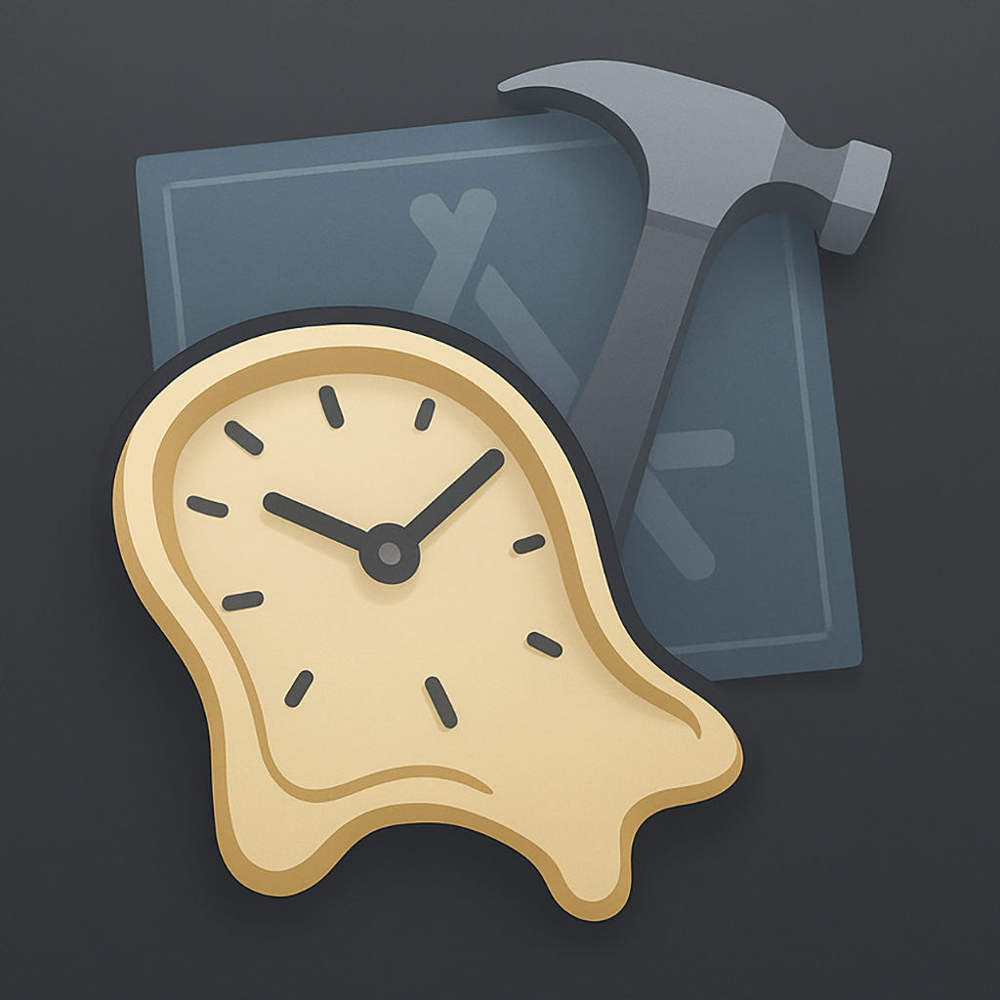
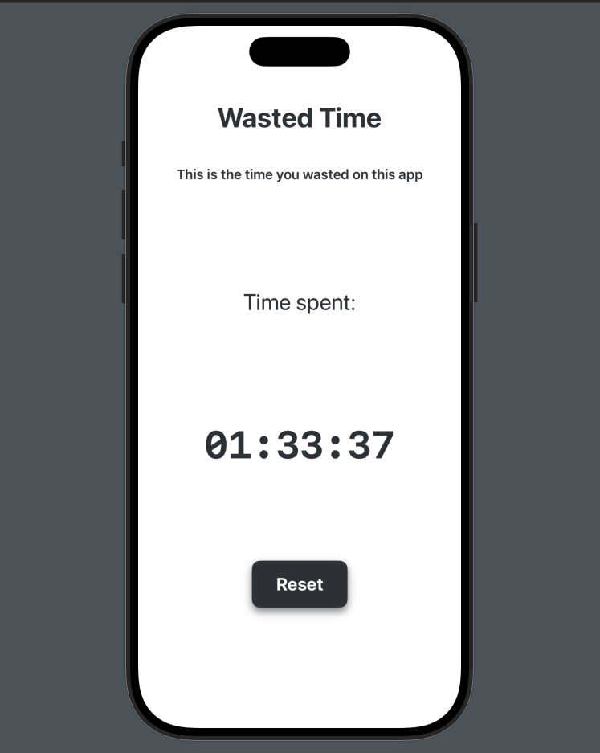

# WastedTime



## Purpose

The purpose of this project is to track the time spent waiting for Xcode builds and to prevent the screen from locking during this process.

## Features

- Automatically tracks the duration of Xcode build times.
- Prevents the screen from locking while waiting for builds to complete.
- Provides insights into the total time spent on builds.

## Installation

1. Clone the repository:
    ```bash
    git clone https://github.com/MaciejGad/WastedTime.git
    ```
2. Navigate to the project directory:
    ```bash
    cd WastedTime
    ```
3. Open the project in Xcode:
    - Launch Xcode on your Mac.
    - In Xcode, go to `File` > `Open...`.
    - Navigate to the `WastedTime` directory and select the `.xcodeproj` or `.xcworkspace` file.
    - Click `Open` to load the project in Xcode.

## Usage

Run the application to start tracking your Xcode build times and keep your screen active.

## Preview



## Contributing

Contributions are welcome! Please fork the repository and submit a pull request.

## License

This project is licensed under the MIT License. See the `LICENSE` file for details.